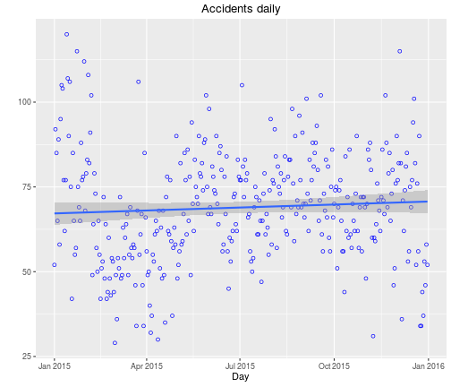

## Contents of the app

App include following information:

1. Monthly accidents; Is there any month more dangerous in traffic tha other?
2. Daily daily accidents; How many accidents we have in Finland daily?
3. Hourly accidents; What is the time of the day when the most of accidents took a place

Data comes from Finnish Transport Agency which collects annual road trafic accident data. It is based on information received from the law enforcement officials and Statistics Finland and it is openly published in Avoindata.fi: http://tinyurl.com/zk2fshn

--- .class #id 

## Sample 1: Daily plot

Number of daily accidents slightly increased untile the of the year 2015.

--- .class #id 

## Sample 2: Which are the most dangerous hours on the roads? 

It is not morgning, it is afternoon.

--- .class #id 

## Where you can find it?

- You can find the free and open reactive shiny application from Shinyapps.io: https://vtenhunen.shinyapps.io/DDP_Course_Project/
- Source code of the app is in the GitHub: https://github.com/vtenhunen/DDP_Course_Project
